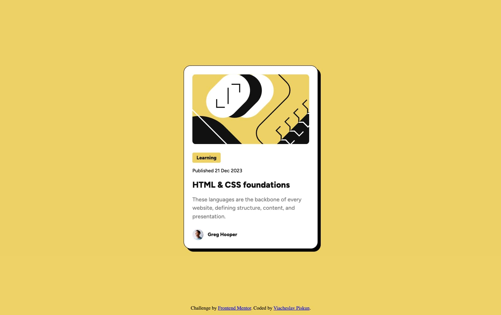
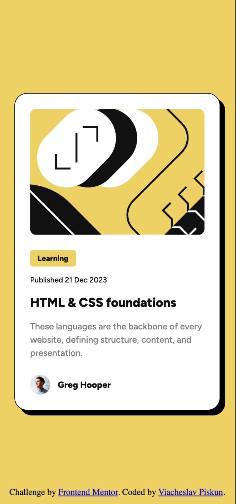

# Frontend Mentor - Blog preview card solution

This is a solution to the [Blog preview card challenge on Frontend Mentor](https://www.frontendmentor.io/challenges/blog-preview-card-ckPaj01IcS).

### [View Demo](https://vyacheslav-piskun.github.io/kata-blog-preview-card/)

## Built with
- Semantic HTML5 markup
- CSS custom properties
- Flexbox
- Mobile-first workflow

## Some development details
- **Added Black Cursor Pointer**: The design specifies a black cursor, suggesting that the designer intended this. Such details should be confirmed with the designer before development. Therefore, a black cursor image is used, with a default standard pointer cursor if the black one fails to load.
- **Increased Drop-Shadow on Focus**: According to the design, the drop-shadow increases on focus, implying that the card functions as a button. Thus, the card is given a role attribute: div.card[role="button"].
- **Text Color Change on Hover**: The design indicates that the text changes color on hover. Since the card acts as a button, the color change should likely occur on the entire card when hovered, not just on the text. This makes it clear that the entire card is clickable, as the designer might have intended.
- **Drop-Shadow Replaced with Box-Shadow**: Replacing drop-shadow with box-shadow resolves issues in Safari and improves page performance. Since the element is rectangular, these properties are interchangeable.
- **Font Connected Online via Google Fonts**: Connecting the font directly from Google Fonts is better for performance, as Google Fonts use CDN, providing faster access for users worldwide.
- **Card Shifted 1px Upwards**: The card is shifted 1px upwards relative to the center. Although this is often negligible, sometimes the designer wants the developer to account for this 1px adjustment. Therefore, it is implemented as if the designer suggested it.
- **Different CSS for Different Screens**: Based on challenges, it's proposed to adjust font-size changing without @media. The approach involves importing css file based on screen size.

### Screenshot

